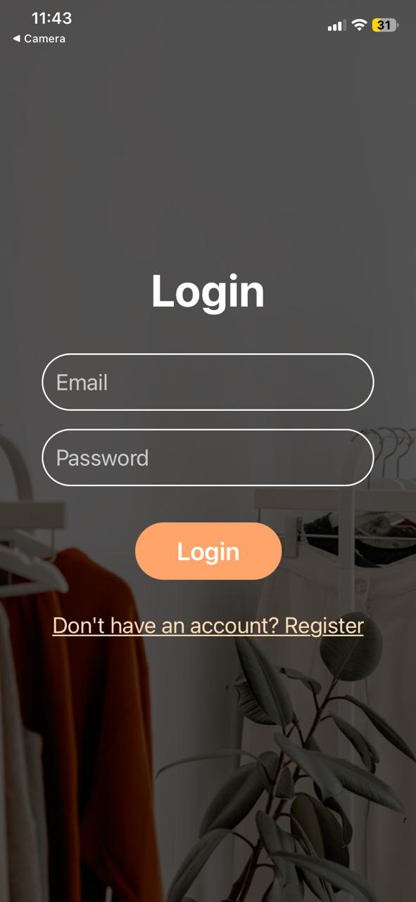
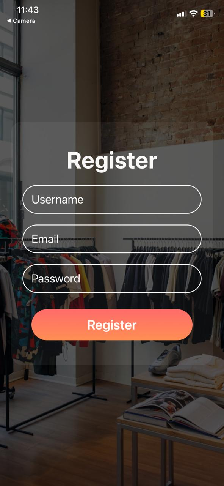
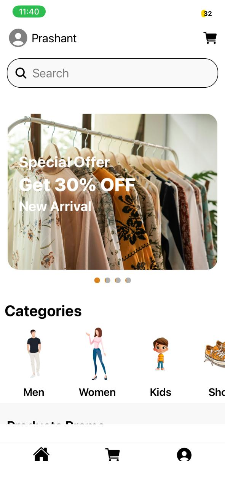
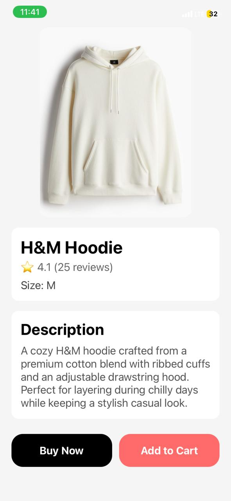
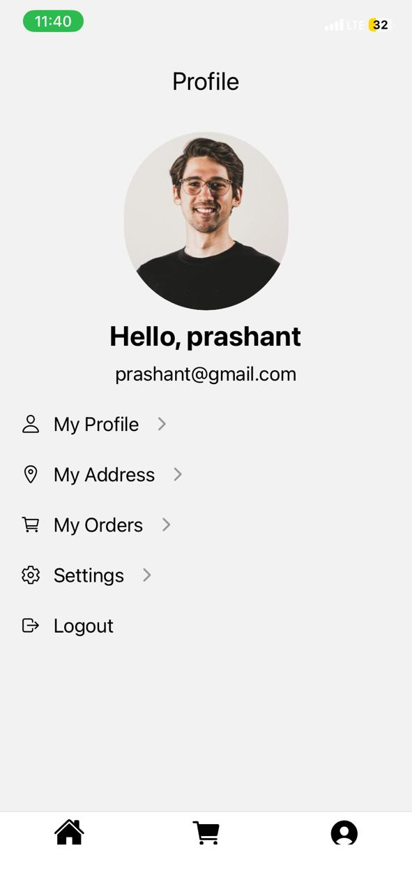
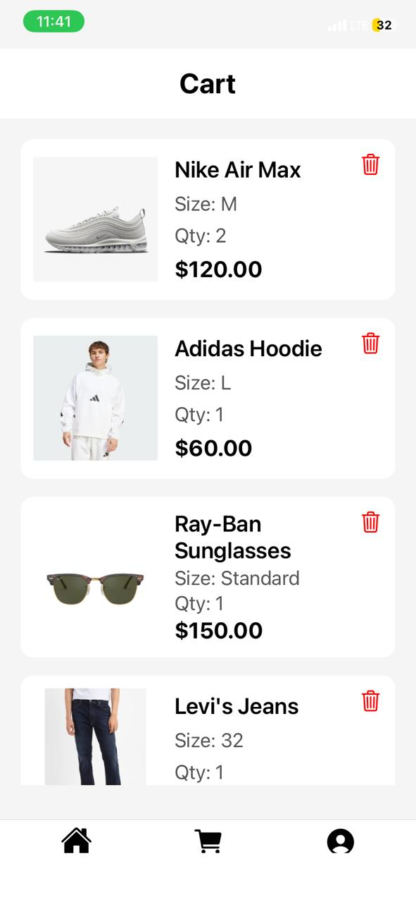
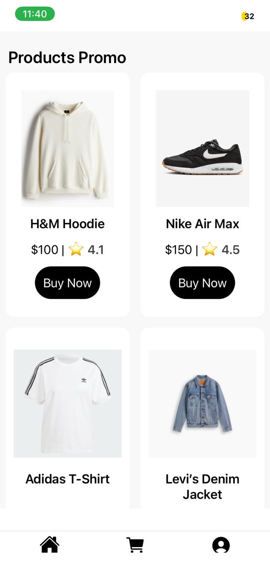
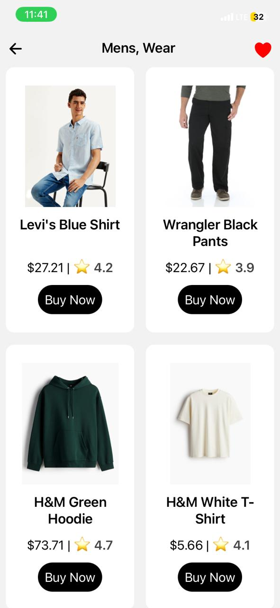
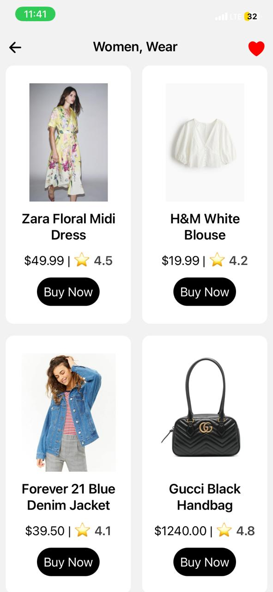
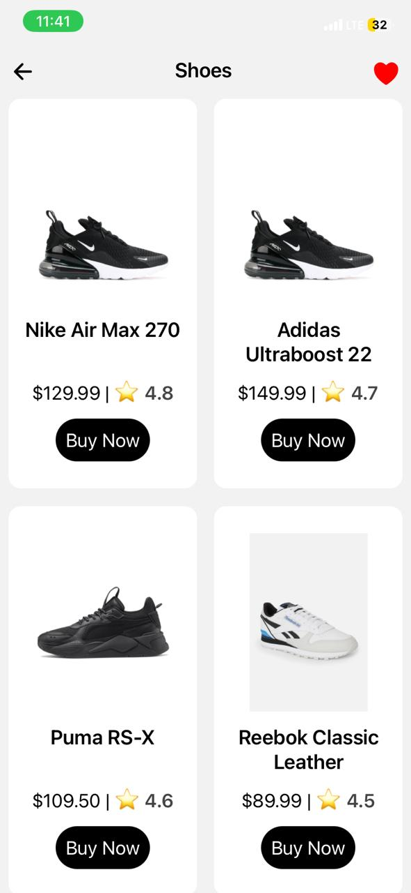

#  Glamora Fashion App (Frontend)

A mobile shopping app built with **React Native** and **Expo**, providing a full-featured fashion shopping experience.  
This project includes **Welcome, Login, Home, Product, Profile, Cart, Categories pages**, and promotional banners.

---

## ⚡ Features

- 👋 **Welcome Screen** – App introduction and navigation  
- 🔑 **Login & Register Screen** – User authentication  
- 🏠 **Home Page** – Browse featured products and categories  
- 🛍️ **Product Page** – Product details with images, description, and ratings  
- 👤 **Profile Page** – User account information  
- 🛒 **Cart Page** – View selected items and checkout  
- 🗂️ **Categories Page** – Browse products by category  
- 🖼️ **Posters / Promotions** – Display banners and promotional content  

---

## 📸 Screenshots

  
  
  
  
  

  
  
  
  
  
  

---

## 🛠️ Tech Stack

- **React Native** – Mobile app development  
- **Expo** – React Native framework for faster development  
- **JavaScript (ES6+)**  
- **React Navigation** – Navigation between screens  
- **Axios / Fetch API** – Backend API integration  
- **react-native-responsive-screen** – Responsive layouts for multiple devices  
- **@expo/vector-icons** – Icons throughout the app  

---

